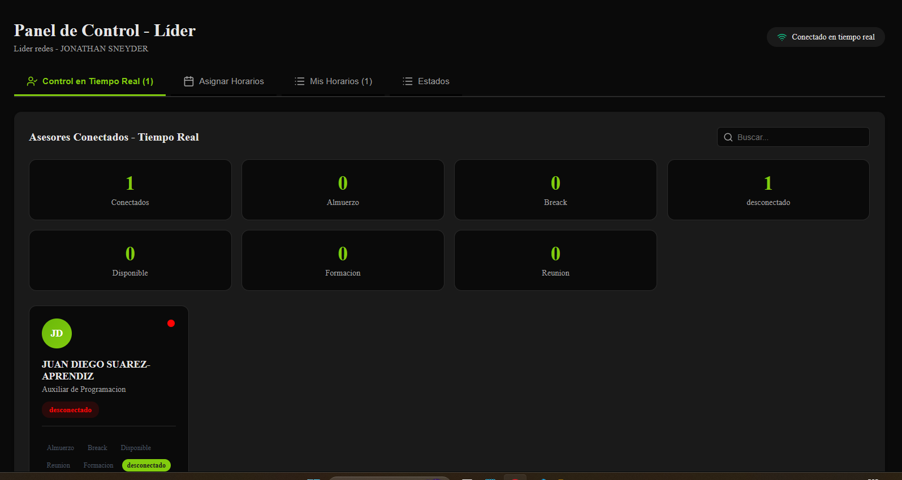
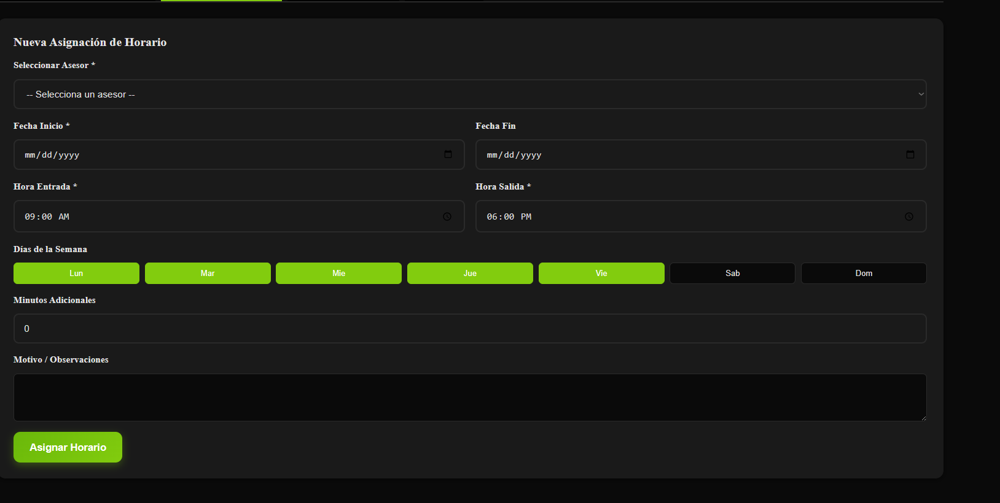
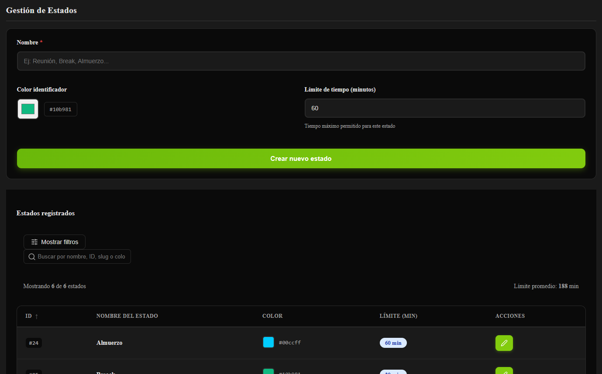

# database_HRS

database_HRS es una aplicación web de gestión de recursos humanos diseñada para centralizar la información del personal y automatizar procesos internos de Distritec.  
Desarrollado con Django y React, el sistema integra módulos para la administración de empleados, control de asistencia y turnos, registro de actividades y comunicación interna, ofreciendo una interfaz accesible desde el navegador y funcionalidades en tiempo real.

## Tecnologías

- Python 3.10.12
- Django
- React
- WebSockets
- SQL

## Diagrama de flujo

[Ver diagrama de flujo](imagenes_documentacion/diagrama.pdf)

## Características

El sistema está enfocado en el seguimiento de la jornada laboral de los colaboradores. En la siguiente demo se puede ver el comportamiento general de la aplicación:

- Seguimiento del estado de cada colaborador en tiempo real.
- Panel de administración de horarios (crear, editar, asignar y eliminar horarios).
- Configuración de estados y reglas asociadas.
- Integración frontend (React) + backend (Django) + WebSockets.

[Ver demo admin](imagenes_documentacion/demo_hrs.mp4)
[Ver demo cliente](imagenes_documentacion/demo_hrs.mp4_cliente.mp4)

### Capturas de pantalla





## Diagrama EER


## Estructura del proyecto (por apps)

- `accounts/` – Módulo de autenticación y gestión de usuarios.
- `core/` – Configuración principal del proyecto y utilidades comunes.
- `frontend/` – Aplicación React (interfaz de usuario).
- `realtime/` – Funcionalidades en tiempo real (WebSockets, notificaciones, servidores Node).
- `workforce/` – Lógica de negocio relacionada con el personal.
- `templates/` – Plantillas HTML.
- `static/` y `staticfiles/` – Archivos estáticos (CSS, JS, imágenes).
- `manage.py` – Script de administración de Django.


# database_HRS ENGLISH

database_HRS is a web-based human resources management application designed to centralize staff information and automate Distritec’s internal processes.  
Built with Django and React, the system integrates modules for employee management, attendance and shift control, activity logging, and internal communication, providing a browser-based interface with real-time features.

## Technologies

- Python 3.10.12
- Django
- React
- WebSockets
- SQL

## Flow diagram

[View flow diagram](imagenes_documentacion/diagrama.pdf)

## Features

The system is focused on tracking employees’ working hours. In the following demos you can see the overall behavior of the application:

- Real-time tracking of each employee’s status.
- Schedule management panel (create, edit, assign, and delete schedules).
- Configuration of statuses and associated rules.
- Frontend (React) + backend (Django) + WebSockets integration.

[View admin demo](imagenes_documentacion/demo_hrs.mp4)  
[View client demo](imagenes_documentacion/demo_hrs.mp4_cliente.mp4)

### Screenshots

  
  


## EER diagram


## Project structure (by apps)

- `accounts/` – Authentication and user management module.
- `core/` – Main project configuration and shared utilities.
- `frontend/` – React application (user interface).
- `realtime/` – Real-time features (WebSockets, notifications, Node servers).
- `workforce/` – Business logic related to staff management.
- `templates/` – HTML templates.
- `static/` and `staticfiles/` – Static files (CSS, JS, images).
- `manage.py` – Django management script.

## File tree (summary)

```text
├── README.md
├── accounts
│   ├── admin.py
│   ├── apps.py
│   ├── auth.py
│   ├── migrations
│   ├── models.py
│   ├── protected.py
│   ├── urls.py
│   ├── utils.py
│   └── views.py
├── core
│   ├── asgi.py
│   ├── dbrouters.py
│   ├── middleware.py
│   ├── settings.py
│   ├── urls.py
│   ├── views.py
│   └── wsgi.py
├── frontend
│   ├── dist/
│   ├── src/
│   ├── package.json
│   ├── vite.config.*
│   └── websocket-server/
├── realtime
│   ├── consumers.py
│   ├── models.py
│   ├── server.js
│   └── package.json
├── workforce
│   ├── models.py
│   ├── serializers.py
│   ├── services.py
│   ├── urls.py
│   ├── views.py
│   └── views_estados.py
├── templates/
├── static/
├── requirements.txt
└── manage.py
